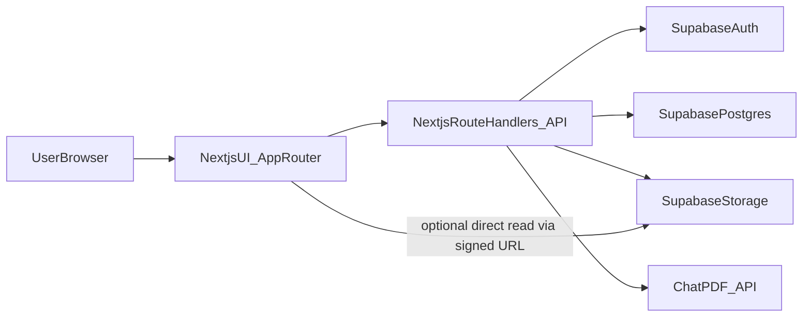
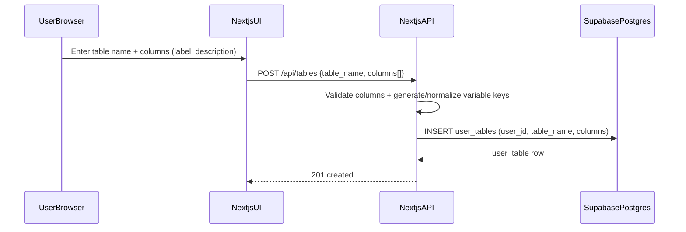
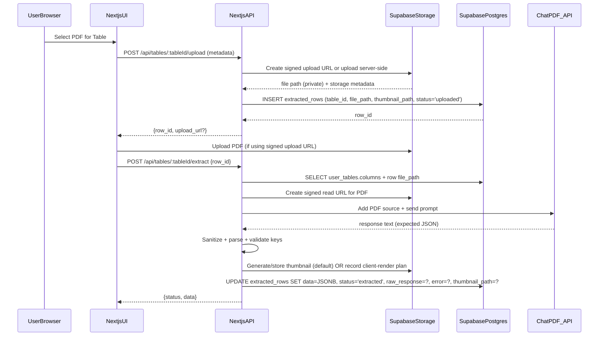
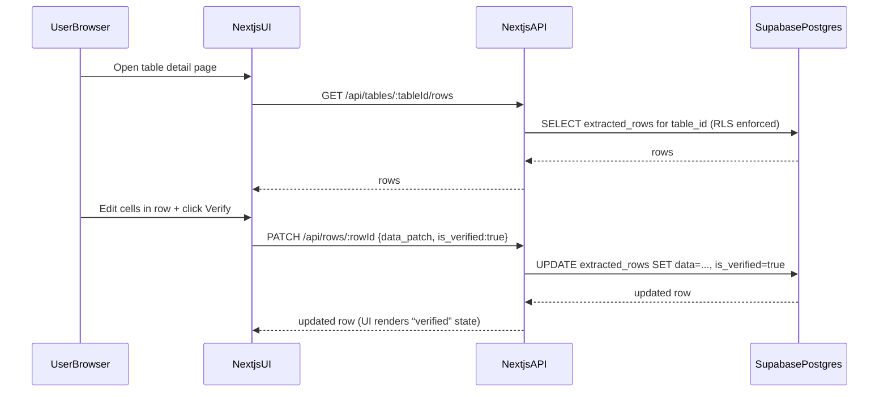

# App Architecture (MVP)

This document describes the architecture for the **AI-Powered PDF Data Extractor (MVP)** described in [`plan/PRD.md`](plan/PRD.md).

## Goals (from PRD)

- Let users create **custom tables** with **custom columns** (schema) without DB migrations.
- Let users upload PDFs to a table, run **AI extraction** (ChatPDF), and store results as **rows**.
- Provide a **human-in-the-loop review**: unverified rows are highlighted; user can edit and verify.
- Show a **PDF thumbnail** at the end of each row (row is based on a PDF).

## Tech Stack (chosen)

- **Frontend**: Next.js (App Router) + React
- **Backend**: Next.js Route Handlers (`app/api/**/route.ts`)
- **Database**: Supabase Postgres (JSONB) + Row Level Security
- **Storage**: Supabase Storage (PDFs + thumbnails)
- **AI**: ChatPDF API

## Core Entities (conceptual)

- **User**: Supabase Auth identity.
- **UserTable**: A user-defined table (name + schema).
- **Column**: A schema entry inside `UserTable.columns` (JSONB array).
- **ExtractedRow**: A data row for a table; holds the PDF reference + extracted JSON.

## System Components

### Client (Browser / Next.js UI)

- Table list UI
- Schema editor UI (add/edit/delete/reorder columns)
- Upload UI (PDF upload to table)
- Table grid UI (rows; “unverified” highlight; edit + verify)
- Thumbnail cell UI (image preview + link to PDF)

### Server (Next.js Route Handlers)

- Issues **signed upload URLs** or performs server-side upload to Storage
- Calls Supabase (DB) with **service role** only where needed (e.g., server-side operations), otherwise uses RLS with user session
- Calls ChatPDF API (keeps API key server-side)
- Sanitizes and validates AI responses; writes rows to DB

### Supabase (Managed)

- Auth: sessions, JWTs, user management
- Postgres: `user_tables`, `extracted_rows`
- Storage: private bucket for PDFs and thumbnails
- RLS: ensures users only read/write their own tables and rows

## High-Level Architecture Diagram

## End-to-End Flows

### 1) Create Table + Schema

Key rules:
- Each column has:
  - `label` (user-facing)
  - `key` (machine-friendly, slugified, unique within table)
  - `desc` (extraction guidance)
  - `order` (integer for deterministic rendering)

### 2) Upload PDF → Extract → Store Row

Default design choice:
- **Private Storage + signed URLs** for reading PDFs/thumbnails.

### 3) Review → Edit → Verify

## Security Model

### Authentication

- Browser uses Supabase Auth session (JWT).
- Next.js Route Handlers authenticate requests by validating the user session (via Supabase server client).

### Authorization (RLS)

Use RLS to ensure:
- A user can only access `user_tables` where `user_tables.user_id = auth.uid()`.
- A user can only access `extracted_rows` that belong to a table they own (via join to `user_tables`).

### Secrets

- ChatPDF API key is **server-only** (environment variable).
- Supabase service role key (if used) is **server-only** and only used when absolutely required.

### Storage Access

Default:
- Storage bucket is **private**.
- Server issues **signed URLs** for read/download and (optionally) signed upload URLs.

Alternative (not recommended for sensitive docs):
- Public bucket with `file_url` stored as public link.

## Storage Strategy (PDFs + Thumbnails)

### Bucket layout (recommended)

- Bucket: `documents` (private)
- Paths:
  - PDFs: `user/{user_id}/table/{table_id}/row/{row_id}.pdf`
  - Thumbnails: `user/{user_id}/table/{table_id}/row/{row_id}.png`

### Thumbnail Strategy (requirement)

**Default: server-generated thumbnail**
- Pros: consistent UI, simple rendering, cheap for client, no PDF.js setup.
- Cons: requires a server-side PDF render step (implementation complexity).

**Alternative: client-rendered thumbnail (PDF.js)**
- Pros: no server-side rendering, easier infra.
- Cons: heavier client bundle, CORS/signed URL complexity, slower for large PDFs.

The MVP plans will assume **server-generated thumbnails** are stored in Storage and referenced in each row. If thumbnail generation is deferred, the UI can show a placeholder icon linking to the PDF.

## Reliability & Failure Modes

### AI extraction failures

Common failure cases:
- ChatPDF returns non-JSON (markdown, prose, partial).
- Missing/extra keys compared to schema.
- Timeouts / rate limits.

Mitigation:
- Store `raw_response` and `error` on the row.
- Add a `status` field on `extracted_rows` (`uploaded|extracting|extracted|failed`).
- UI shows a “failed” badge and allows manual entry + retry.

### Schema changes after rows exist

Because schema is JSONB:
- Adding a column: older rows simply render `null/empty` for that column.
- Renaming a key: requires migration logic (prefer “add new column + deprecate old”).
- Deleting a column: keep historical data in row JSON, but UI hides deleted columns.

## Observability (MVP)

- Server logs per request:
  - table_id, row_id
  - ChatPDF latency + status
  - sanitizer parse outcomes
- Store minimal fields on row:
  - `status`, `error`, `raw_response` (truncated), timestamps

