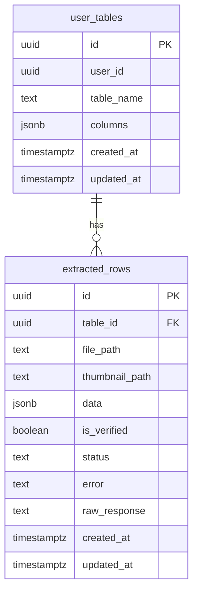

# Backend & Database Plan (Supabase Postgres + Storage)

This document specifies the **database schema**, **RLS policies**, and **Storage bucket policies/structure** for the MVP described in [`plan/PRD.md`](plan/PRD.md).

## Goals

- Store user-defined table schemas without migrations (**JSONB columns**).
- Store extracted rows with AI output (**JSONB**), verification state, and error/status metadata.
- Enforce strict isolation per user via **RLS**.
- Store PDFs and thumbnails in Supabase **Storage** (private), accessed via **signed URLs**.

## Entities & Relationships



## JSONB Shapes (contract)

### `user_tables.columns` (JSONB array)

Array of column definitions; render order is `order` ascending.

Example:

```json
[
  { "label": "Total Amount", "key": "total_amount", "desc": "Final amount incl. tax", "order": 1 },
  { "label": "Vendor", "key": "vendor", "desc": "Vendor/company name", "order": 2 }
]
```

Rules:
- `key` must be unique within a table.
- `order` must be unique or at least deterministic.
- `desc` should be required for extraction quality.

### `extracted_rows.data` (JSONB object)

Object whose keys correspond to column keys:

```json
{ "total_amount": 150.0, "vendor": "Acme", "invoice_date": "2024-01-01" }
```

Rules:
- Missing fields should be `null` (preferred) or omitted; UI treats missing as empty.
- Extra keys may be stored but should be ignored by the UI unless they match schema.

## SQL DDL (copy/paste)

> Note: this is designed for Supabase public schema. Adjust schema name if needed.

```sql
-- Enable useful extensions (optional but recommended)
create extension if not exists "pgcrypto";

-- 1) user_tables: stores user-defined table schema
create table if not exists public.user_tables (
  id uuid primary key default gen_random_uuid(),
  user_id uuid not null references auth.users (id) on delete cascade,
  table_name text not null,
  columns jsonb not null default '[]'::jsonb,
  created_at timestamptz not null default now(),
  updated_at timestamptz not null default now()
);

create index if not exists user_tables_user_id_idx on public.user_tables (user_id);

-- 2) extracted_rows: stores extracted data per uploaded PDF
create table if not exists public.extracted_rows (
  id uuid primary key default gen_random_uuid(),
  table_id uuid not null references public.user_tables (id) on delete cascade,

  -- Storage references (private bucket paths, not public URLs)
  file_path text not null,
  thumbnail_path text,

  -- Extracted data + review state
  data jsonb not null default '{}'::jsonb,
  is_verified boolean not null default false,

  -- Extraction lifecycle + error/debug
  status text not null default 'uploaded',  -- uploaded|extracting|extracted|failed
  error text,
  raw_response text,

  created_at timestamptz not null default now(),
  updated_at timestamptz not null default now()
);

create index if not exists extracted_rows_table_id_idx on public.extracted_rows (table_id);
create index if not exists extracted_rows_status_idx on public.extracted_rows (status);
create index if not exists extracted_rows_verified_idx on public.extracted_rows (is_verified);

-- Optional: GIN index for JSONB queries (useful later for filtering/search)
-- create index if not exists extracted_rows_data_gin_idx on public.extracted_rows using gin (data);

-- updated_at trigger helper
create or replace function public.set_updated_at()
returns trigger
language plpgsql
as $$
begin
  new.updated_at = now();
  return new;
end;
$$;

drop trigger if exists set_user_tables_updated_at on public.user_tables;
create trigger set_user_tables_updated_at
before update on public.user_tables
for each row
execute function public.set_updated_at();

drop trigger if exists set_extracted_rows_updated_at on public.extracted_rows;
create trigger set_extracted_rows_updated_at
before update on public.extracted_rows
for each row
execute function public.set_updated_at();
```

## Row Level Security (RLS)

### Principles

- A user can only see/modify `user_tables` they own.
- A user can only see/modify `extracted_rows` whose `table_id` belongs to a table they own.

### RLS SQL (copy/paste)

```sql
-- Enable RLS
alter table public.user_tables enable row level security;
alter table public.extracted_rows enable row level security;

-- user_tables policies
drop policy if exists user_tables_select_own on public.user_tables;
create policy user_tables_select_own
on public.user_tables
for select
using (user_id = auth.uid());

drop policy if exists user_tables_insert_own on public.user_tables;
create policy user_tables_insert_own
on public.user_tables
for insert
with check (user_id = auth.uid());

drop policy if exists user_tables_update_own on public.user_tables;
create policy user_tables_update_own
on public.user_tables
for update
using (user_id = auth.uid())
with check (user_id = auth.uid());

drop policy if exists user_tables_delete_own on public.user_tables;
create policy user_tables_delete_own
on public.user_tables
for delete
using (user_id = auth.uid());

-- extracted_rows policies (ownership via join)
drop policy if exists extracted_rows_select_own on public.extracted_rows;
create policy extracted_rows_select_own
on public.extracted_rows
for select
using (
  exists (
    select 1
    from public.user_tables t
    where t.id = extracted_rows.table_id
      and t.user_id = auth.uid()
  )
);

drop policy if exists extracted_rows_insert_own on public.extracted_rows;
create policy extracted_rows_insert_own
on public.extracted_rows
for insert
with check (
  exists (
    select 1
    from public.user_tables t
    where t.id = extracted_rows.table_id
      and t.user_id = auth.uid()
  )
);

drop policy if exists extracted_rows_update_own on public.extracted_rows;
create policy extracted_rows_update_own
on public.extracted_rows
for update
using (
  exists (
    select 1
    from public.user_tables t
    where t.id = extracted_rows.table_id
      and t.user_id = auth.uid()
  )
)
with check (
  exists (
    select 1
    from public.user_tables t
    where t.id = extracted_rows.table_id
      and t.user_id = auth.uid()
  )
);

drop policy if exists extracted_rows_delete_own on public.extracted_rows;
create policy extracted_rows_delete_own
on public.extracted_rows
for delete
using (
  exists (
    select 1
    from public.user_tables t
    where t.id = extracted_rows.table_id
      and t.user_id = auth.uid()
  )
);
```

## Storage Bucket Plan

### Bucket

- Bucket name: `documents`
- Visibility: **private**

### Path Structure

- PDFs: `user/{user_id}/table/{table_id}/row/{row_id}.pdf`
- Thumbnails: `user/{user_id}/table/{table_id}/row/{row_id}.png`

Store these paths in DB:
- `extracted_rows.file_path` → PDF path
- `extracted_rows.thumbnail_path` → thumbnail path

### Access Pattern

Default:
- Server issues signed URLs for:
  - upload (optional) using signed upload URL pattern, or uploads server-side
  - read/download of PDFs
  - read of thumbnails

Avoid:
- Storing permanent public URLs for user documents (unless you explicitly want public sharing).

### Storage Policies (recommended approach)

For MVP, keep Storage policies simple:
- Keep bucket private.
- Use signed URLs generated by server-side code.

If you prefer RLS-like Storage policies (optional), implement path-based restrictions (e.g., user can only access `user/{auth.uid()}/**`). This requires careful policy writing and testing; signed URLs are simpler and safer for an MVP.

## Integrity & Performance Notes

- **Indexes**:
  - `user_tables.user_id` for listing user tables
  - `extracted_rows.table_id` for listing rows per table
  - `status` and `is_verified` for filtering in UI
- **JSONB**:
  - Defer JSONB GIN indexing until you need advanced filtering/search.
- **Schema evolution**:
  - Adding columns is safe (old rows show null/empty).
  - Deleting columns is safe (UI stops rendering them).
  - Renaming keys is dangerous—prefer add-new + deprecate-old.


